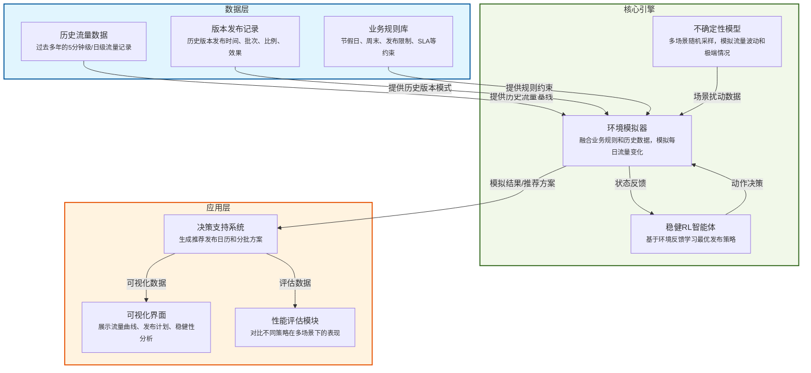

# 手机发布版本编排强化学习系统

## 📋 项目简介

本项目是一个完整的基于强化学习的手机版本发布编排系统，通过稳健性优化与不确定性建模技术，实现在复杂多变的环境下制定最优发布策略。系统综合考虑历史流量数据、版本特性和业务规则约束，生成稳健的发布日历和分批方案，降低带宽压力并确保服务质量。

## ✨ 核心特性

- **稳健强化学习**：基于PPO算法的智能体，适应不确定性环境
- **多场景模拟**：支持正常、极端、节假日等多种场景的流量模拟
- **不确定性建模**：集成多种不确定性模型，提供稳健的决策支持
- **业务规则内嵌**：自动避开周末、节假日，确保发布合规性
- **可解释性**：提供决策解释和可视化分析
- **完整评估体系**：多维度性能评估和基准比较
- **生产就绪**：提供API接口和决策支持系统

## 🏗 系统总体架构



## 🎯 核心设计理念

1. **只依赖可观测信息**  
   状态只基于当前和历史数据，不包含任何未来真实值。  
2. **不确定性建模**  
   在环境中引入多场景模拟与随机扰动，反映未来流量的波动性与不可预测性。  
3. **稳健性优化**  
   奖励函数同时考虑平均表现与最坏情况表现，确保策略在极端场景下仍表现良好。  
4. **业务规则内嵌**  
   发布日合法性检查（避开周末、节假日、重复发布），违规直接惩罚。  

## 📂 项目目录结构

```
optimization_model/
├── README.md                         # 项目总说明
├── requirements.txt                  # Python依赖包列表
├── config/                          # 配置文件目录
│   ├── base.yaml                    # 基础配置（数据、环境、模型）
│   ├── train.yaml                   # 训练配置（超参数、课程学习）
│   ├── eval.yaml                    # 评估配置（指标、基准）
│   ├── application.yaml             # 应用配置（API、可视化）
│   ├── environment.yaml             # 环境配置
│   ├── models.yaml                  # 模型配置
│   └── scenarios/                   # 场景配置文件
│       ├── normal_scenario.yaml     # 正常场景配置
│       ├── extreme_scenario.yaml    # 极端场景配置
│       └── holiday_scenario.yaml    # 节假日场景配置
├── data/                            # 数据目录
│   ├── __init__.py
│   ├── raw/                         # 原始数据
│   │   ├── traffic/                 # 历史流量数据
│   │   ├── releases/                # 版本发布记录
│   │   └── rules/                   # 业务规则数据
│   ├── processed/                   # 处理后的数据
│   │   ├── features/                # 特征数据
│   │   ├── scenarios/               # 场景数据
│   │   └── normalized/              # 归一化数据
│   └── external/                    # 外部数据
│       ├── holidays/                # 节假日数据
│       └── events/                  # 特殊事件数据
├── src/                             # 源代码目录
│   ├── __init__.py
│   ├── data_processing/             # 数据处理模块
│   │   ├── __init__.py
│   │   ├── data_loader.py           # 数据加载器
│   │   ├── preprocessor.py          # 数据预处理
│   │   ├── feature_engineer.py      # 特征工程
│   │   └── scenario_generator.py    # 场景生成器
│   ├── environment/                 # 环境模拟模块
│   │   ├── __init__.py
│   │   ├── base_env.py              # 基础环境类
│   │   ├── mobile_release_env.py    # 手机发布环境
│   │   ├── state.py                 # 状态表示
│   │   ├── action.py                # 动作空间
│   │   ├── reward.py                # 奖励计算
│   │   └── validator.py             # 规则验证器
│   ├── models/                      # 模型模块
│   │   ├── __init__.py
│   │   ├── base_agent.py            # 智能体基类
│   │   ├── ppo_agent.py             # PPO智能体
│   │   ├── uncertainty_model.py     # 不确定性模型
│   │   ├── version_impact.py        # 版本影响模型
│   │   └── traffic_predictor.py     # 流量预测模型(可选)
│   ├── training/                    # 训练模块
│   │   ├── __init__.py
│   │   ├── trainer.py               # 训练器
│   │   ├── callback.py              # 训练回调
│   │   ├── curriculum.py            # 课程学习
│   │   └── domain_randomization.py  # 域随机化
│   ├── evaluation/                  # 评估模块
│   │   ├── __init__.py
│   │   ├── evaluator.py             # 评估器
│   │   ├── metrics.py               # 评估指标
│   │   ├── baselines.py             # 基准策略
│   │   ├── comparator.py            # 策略比较
│   │   └── robustness_analyzer.py   # 稳健性分析
│   ├── application/                 # 应用模块
│   │   ├── __init__.py
│   │   ├── decision_system.py       # 决策支持系统
│   │   ├── visualization.py         # 可视化工具
│   │   ├── api.py                   # API接口
│   │   └── explainer.py             # 可解释性工具
│   ├── utils/                       # 工具函数
│   │   ├── __init__.py
│   │   ├── logger.py                # 日志工具
│   │   ├── helper.py                # 辅助函数
│   │   └── serialization.py         # 序列化工具
│   └── scripts/                     # 执行脚本
│       ├── __init__.py
│       ├── train_model.py           # 训练脚本
│       ├── evaluate_model.py        # 评估脚本
│       ├── generate_recommendation.py # 生成推荐
│       └── run_api.py               # API服务脚本
├── models/                          # 模型存储目录
│   ├── checkpoints/                 # 训练检查点
│   ├── best/                        # 最佳模型
│   └── experiments/                 # 实验记录
│       ├── experiment_001/          # 实验1
│       └── experiment_002/          # 实验2
└── results/                         # 结果输出目录
    ├── reports/                     # 报告文件
    ├── visualizations/              # 可视化结果
    ├── recommendations/             # 推荐方案
    └── comparisons/                 # 比较结果
```

## 🧩 系统模块详细说明

### 📊 数据处理模块 (`src/data_processing/`)

#### `data_loader.py` - 数据加载器
- **功能**：统一的数据加载接口，支持多种数据格式
- **支持格式**：CSV、JSON、HDF5等
- **主要方法**：
  - `load_traffic_data()`: 加载历史流量数据
  - `load_release_data()`: 加载版本发布记录
  - `load_business_rules()`: 加载业务规则
  - `load_holidays()`: 加载节假日数据
  - `load_special_events()`: 加载特殊事件数据

#### `preprocessor.py` - 数据预处理
- **功能**：数据清洗、异常值处理、时间序列连续性保证
- **主要方法**：
  - `preprocess_traffic_data()`: 流量数据预处理
  - `preprocess_release_data()`: 发布数据预处理
  - `_handle_missing_values()`: 缺失值处理
  - `_remove_outliers()`: 异常值检测和移除

#### `feature_engineer.py` - 特征工程
- **功能**：从原始数据中提取有意义的特征
- **特征类型**：
  - 流量统计特征（均值、标准差、分位数）
  - 时间特征（星期、月份、节假日标识）
  - 趋势特征（滑动窗口统计、变化率）
  - 发布相关特征（发布间隔、发布密度）

#### `scenario_generator.py` - 场景生成器
- **功能**：生成多种不确定性场景用于稳健性训练
- **场景类型**：
  - 正常场景：低不确定性，稳定流量模式
  - 极端场景：高不确定性，突发流量变化
  - 节假日场景：特殊时间模式，流量异常

### 🎮 环境模拟模块 (`src/environment/`)

#### `base_env.py` - 基础环境类
- **功能**：实现Gym接口的强化学习环境基类
- **核心组件**：
  - 状态表示器：将环境状态转换为智能体可理解的向量
  - 动作空间：定义智能体可执行的动作
  - 奖励计算器：根据动作和结果计算奖励
  - 规则验证器：确保动作符合业务规则

#### `mobile_release_env.py` - 手机发布环境
- **功能**：继承基础环境，实现手机版本发布的具体逻辑
- **特性**：
  - 多场景支持：随机选择不同场景进行训练
  - 稳健性奖励：基于多场景表现计算奖励
  - 实时状态更新：动态更新流量历史和发布日历

#### `state.py` - 状态表示
- **功能**：将环境状态编码为智能体可理解的向量
- **状态维度**：
  - 当前天数和剩余天数
  - 发布日历（31位二进制数组）
  - 版本信息（用户数、包大小、试点比例等）
  - 流量统计特征（均值、标准差、分位数）
  - 流量趋势（最近7天变化率）

#### `action.py` - 动作空间
- **功能**：定义智能体的动作空间
- **动作类型**：
  - 0：不发布
  - 1：发布当前版本
- **扩展性**：支持多离散和连续动作空间

#### `reward.py` - 奖励计算
- **功能**：计算智能体动作的奖励
- **奖励组成**：
  - 发布奖励：鼓励有效发布
  - 流量平滑奖励：惩罚流量波动
  - 规则违规惩罚：大额负奖励
  - 稳健性奖励：基于多场景表现

#### `validator.py` - 规则验证器
- **功能**：验证动作是否符合业务规则
- **验证规则**：
  - 避开周末和节假日
  - 最小发布间隔限制
  - 避免重复发布

### 🤖 模型模块 (`src/models/`)

#### `base_agent.py` - 智能体基类
- **功能**：定义智能体的通用接口
- **主要方法**：
  - `train()`: 训练智能体
  - `predict()`: 预测动作
  - `save()`/`load()`: 模型保存和加载

#### `ppo_agent.py` - PPO智能体
- **功能**：基于PPO算法的强化学习智能体
- **特性**：
  - 稳定的策略梯度方法
  - 支持学习率调度
  - 自动熵调节
  - 梯度裁剪防止训练不稳定

#### `uncertainty_model.py` - 不确定性模型
- **功能**：估计预测的不确定性
- **模型类型**：
  - 集成模型：多个模型投票
  - 贝叶斯神经网络：MC Dropout近似
  - Dropout网络：训练时随机失活

#### `version_impact.py` - 版本影响模型
- **功能**：建模版本发布对流量影响
- **影响因子**：
  - 用户数量
  - 包大小
  - 试点比例
  - 流量模式

### 🏋️ 训练模块 (`src/training/`)

#### `trainer.py` - 训练器
- **功能**：管理整个训练流程
- **特性**：
  - 向量化环境支持
  - 自动评估和检查点保存
  - 训练进度监控
  - 最佳模型选择

#### `callback.py` - 训练回调
- **功能**：训练过程中的事件处理
- **回调类型**：
  - 检查点保存回调
  - 课程学习回调
  - 域随机化回调
  - 早停回调

#### `curriculum.py` - 课程学习
- **功能**：渐进式难度提升
- **学习阶段**：
  - 简单阶段：低不确定性，固定模式
  - 中等阶段：中等不确定性，随机模式
  - 困难阶段：高不确定性，极端场景

#### `domain_randomization.py` - 域随机化
- **功能**：随机化环境参数提高泛化能力
- **随机化参数**：
  - 流量基线
  - 周末/节假日因子
  - 版本影响不确定性

### 📈 评估模块 (`src/evaluation/`)

#### `evaluator.py` - 策略评估器
- **功能**：评估策略在不同场景下的性能
- **评估类型**：
  - 单场景评估
  - 多场景评估
  - 基准比较评估

#### `metrics.py` - 评估指标
- **功能**：计算各种性能指标
- **指标类型**：
  - 流量指标：均值、方差、稳定性
  - 发布指标：发布数量、间隔、合规性
  - 稳健性指标：最坏情况表现、一致性

#### `baselines.py` - 基准策略
- **功能**：实现多种基准策略用于比较
- **策略类型**：
  - 随机策略
  - 基于规则的策略
  - 优化策略（遗传算法等）

#### `robustness_analyzer.py` - 稳健性分析
- **功能**：分析策略在不确定性环境下的稳健性
- **分析维度**：
  - 最坏情况分析
  - 风险价值（VaR）
  - 条件风险价值（CVaR）

### 🎯 应用模块 (`src/application/`)

#### `decision_system.py` - 决策支持系统
- **功能**：提供版本发布推荐和策略分析
- **主要功能**：
  - 生成多个推荐方案
  - 多场景稳健性评估
  - 置信度计算
  - 决策解释

#### `visualization.py` - 可视化引擎
- **功能**：生成各种可视化图表
- **图表类型**：
  - 流量曲线图
  - 发布日历图
  - 稳健性分析图
  - 性能对比图

#### `api.py` - API接口
- **功能**：提供RESTful API服务
- **主要接口**：
  - 推荐生成接口
  - 模型评估接口
  - 可视化数据接口
  - 系统状态接口

#### `explainer.py` - 模型解释器
- **功能**：提供模型决策的可解释性分析
- **解释方法**：
  - SHAP值分析
  - 特征重要性
  - 决策树解释

### 🛠️ 工具模块 (`src/utils/`)

#### `logger.py` - 日志工具
- **功能**：统一的日志记录接口
- **特性**：
  - 多级别日志
  - 格式化输出
  - 文件和控制台输出

#### `serialization.py` - 序列化工具
- **功能**：模型和数据的序列化
- **支持格式**：
  - JSON
  - YAML
  - Pickle
  - PyTorch模型

#### `helper.py` - 辅助函数
- **功能**：通用辅助函数
- **包含功能**：
  - 数据转换
  - 数学计算
  - 文件操作

### 📜 脚本模块 (`src/scripts/`)

#### `train_model.py` - 训练脚本
- **功能**：命令行训练接口
- **参数**：
  - 配置文件路径
  - 恢复训练检查点
  - 日志级别

#### `evaluate_model.py` - 评估脚本
- **功能**：命令行评估接口
- **参数**：
  - 模型路径
  - 评估场景
  - 基准比较选项

#### `generate_recommendation.py` - 推荐生成脚本
- **功能**：命令行推荐生成接口
- **参数**：
  - 版本信息
  - 场景选择
  - 输出路径

#### `run_api.py` - API服务脚本
- **功能**：启动API服务
- **参数**：
  - 主机地址
  - 端口号
  - 工作进程数  

## 🎮 环境设计

### 状态空间（State）
- 当前天数（0~30）
- 剩余天数（0~31）
- 发布日历（31位二进制数组）
- 版本信息（用户数、包大小、周期、试点比例、流量模式均值）
- 历史流量统计特征（均值、标准差、25分位、75分位）
- 流量趋势（最近7天均值与前7天均值变化率）

### 动作空间（Action）
- 0：不发布
- 1：发布当前待发布版本

### 规则校验
- 避开周末、节假日
- 避免同日重复发布
- 非法动作直接给予大负奖励

## 🔮 不确定性模拟
- **多场景生成**：每次发布动作生成K个可能的未来流量场景（默认100个）  
- **历史基线驱动**：基于历史同期数据采样未来每日流量基线  
- **版本影响模型**：
  - 基础影响 = 用户数 × 包大小 × 流量模式均值
  - 随机扰动因子（如正态分布 N(1.0, 0.3)）
  - 影响持续指定天数并按比例衰减

## 🏆 奖励函数（Reward）
奖励由三部分组成：
1. **平均方差惩罚**：  
   对K个场景计算整月流量的方差并取平均值，值越小越好
2. **最坏情况惩罚**：  
   找出方差最大的场景，乘以权重β进行惩罚
3. **规则违规惩罚**：  
   非法发布日直接扣除固定大额分数

公式：
$$
Reward = -\text{avg\_variance} - \beta \times \text{worst\_variance} - P_{illegal}
$$

## 📊 训练与评估流程

### 训练流程
1. 初始化环境与智能体  
2. 每个训练回合：
   - 重置环境，随机化节假日、流量波动等参数（域随机化）
   - 智能体基于状态选择动作
   - 环境执行动作，返回新状态与奖励
   - 存储经验并持续到月末或版本发布完毕
3. 回合结束后更新策略  
4. 定期保存最佳模型

### 评估方法
- **多场景评估**：  
  在固定极端流量波动场景下测试策略，计算平均方差、最坏情况方差等稳健性指标  
- **对比基准**：  
  与遗传算法（GA）方案比较最坏场景表现  
- **可视化**：  
  绘制训练曲线与流量分布，生成发布日历CSV供业务分析  

## 🚀 实施步骤与时间规划

| 阶段 | 时间 | 工作内容 |
|------|------|----------|
| 阶段1 | 1-2周 | 数据准备与清洗，收集历史流量与版本信息 |
| 阶段2 | 2周 | 环境模拟器开发，复用GA的版本与流量计算逻辑 |
| 阶段3 | 2周 | 引入不确定性模拟与稳健性奖励 |
| 阶段4 | 2-4周 | 使用PPO训练智能体，调参优化（β、K、波动范围等） |
| 阶段5 | 1周 | 稳健性评估与与GA对比分析 |
| 阶段6 | 持续 | 部署上线，结合业务反馈迭代优化 |

## ✅ 预期效果
- **抗不确定性**：在流量预测不准确的情况下依然能生成稳定方案  
- **规则合规性**：自动避开节假日、周末和冲突日  
- **全月均衡**：减少峰值，降低带宽压力  
- **可解释性**：通过多场景分析理解策略决策依据  
- **可扩展性**：可根据业务变化调整奖励权重、动作空间等  

## 🔧 安装与使用

### 环境要求
- Python 3.8+
- PyTorch 1.9+
- Stable-Baselines3 1.6+
- Gym 0.21+
- 其他依赖详见requirements.txt

### 安装步骤
1. 克隆项目仓库
```bash
git clone <repository-url>
cd optimization_model
```

2. 创建虚拟环境（推荐）
```bash
python -m venv venv
source venv/bin/activate  # Linux/Mac
# 或
venv\Scripts\activate  # Windows
```

3. 安装依赖
```bash
pip install -r requirements.txt
```

4. 准备数据文件
```bash
# 创建数据目录结构
mkdir -p data/raw/traffic
mkdir -p data/raw/releases
mkdir -p data/raw/rules
mkdir -p data/external/holidays
mkdir -p data/external/events

# 将您的数据文件放置在相应目录下
# 详见数据格式说明部分
```

### 快速开始

#### 1. 训练模型
```bash
# 使用默认配置训练
python src/scripts/train_model.py

# 使用自定义配置训练
python src/scripts/train_model.py --config config/train.yaml

# 从检查点恢复训练
python src/scripts/train_model.py --resume models/checkpoints/ppo_checkpoint_0001_50000.zip
```

#### 2. 评估模型
```bash
# 评估单个场景
python src/scripts/evaluate_model.py --model models/best/ppo_mobile_release.zip --scenario normal

# 评估所有场景
python src/scripts/evaluate_model.py --model models/best/ppo_mobile_release.zip --scenario all

# 与基准策略比较
python src/scripts/evaluate_model.py --model models/best/ppo_mobile_release.zip --scenario extreme --compare
```

#### 3. 生成推荐方案
```bash
# 生成发布推荐
python src/scripts/generate_recommendation.py --version_info data/raw/releases/next_version.json

# 指定场景生成推荐
python src/scripts/generate_recommendation.py --scenario holiday --output results/recommendation.json
```

#### 4. 启动API服务
```bash
# 启动决策支持API
python src/scripts/run_api.py --host 0.0.0.0 --port 8000
```

## 🚀 执行脚本详细说明

### 📜 脚本概览

系统提供了四个主要的执行脚本，覆盖了从模型训练到生产部署的完整流程：

| 脚本名称 | 功能描述 | 主要用途 |
|---------|---------|---------|
| `train_model.py` | 模型训练脚本 | 训练强化学习智能体 |
| `evaluate_model.py` | 模型评估脚本 | 评估模型性能和稳健性 |
| `generate_recommendation.py` | 推荐生成脚本 | 生成发布推荐方案 |
| `run_api.py` | API服务脚本 | 启动生产环境API服务 |

### 🏋️ 训练脚本 (`train_model.py`)

#### 功能说明
训练强化学习智能体，支持PPO算法、课程学习、域随机化等高级训练技术。

#### 完整命令示例
```bash
# 基础训练
python src/scripts/train_model.py

# 使用自定义配置训练
python src/scripts/train_model.py --config config/train.yaml

# 从检查点恢复训练
python src/scripts/train_model.py --resume models/checkpoints/ppo_checkpoint_0001_50000.zip

# 设置详细日志级别
python src/scripts/train_model.py --log-level DEBUG

# 组合使用
python src/scripts/train_model.py \
    --config config/train.yaml \
    --resume models/checkpoints/ppo_checkpoint_0001_50000.zip \
    --log-level INFO
```

#### 参数说明
- `--config`: 训练配置文件路径（默认：`config/train.yaml`）
- `--resume`: 从指定检查点恢复训练
- `--log-level`: 日志级别（DEBUG/INFO/WARNING/ERROR/CRITICAL）

#### 输出结果
- 训练好的模型文件保存在 `models/` 目录
- 训练日志保存在 `logs/` 目录
- 训练指标和图表保存在 `results/` 目录

### 📊 评估脚本 (`evaluate_model.py`)

#### 功能说明
评估训练好的模型在不同场景下的性能，支持与基准策略比较和稳健性分析。

#### 完整命令示例
```bash
# 评估单个场景
python src/scripts/evaluate_model.py \
    --model models/best/ppo_mobile_release.zip \
    --scenario normal

# 极速评估所有场景
python src/scripts/evaluate_model.py \
    --model models/best/ppo_mobile_release.zip \
    --scenario all \
    --fast-mode

# 与基准策略比较
python src/scripts/evaluate_model.py \
    --model models/best/ppo_mobile_release.zip \
    --scenario extreme \
    --compare

# 自定义评估回合数
python src/scripts/evaluate_model.py \
    --model models/best/ppo_mobile_release.zip \
    --scenario holiday \
    --n-episodes 100

# 保存评估结果
python src/scripts/evaluate_model.py \
    --model models/best/ppo_mobile_release.zip \
    --scenario all \
    --output results/evaluation_results.json

# 组合使用
python src/scripts/evaluate_model.py \
    --model models/best/ppo_mobile_release.zip \
    --config config/eval.yaml \
    --scenario all \
    --compare \
    --n-episodes 200 \
    --output results/comprehensive_evaluation.json \
    --log-level INFO
```

#### 参数说明
- `--model`: 模型文件路径（必需）
- `--config`: 评估配置文件路径（默认：`config/eval.yaml`）
- `--scenario`: 评估场景（normal/extreme/holiday/all）
- `--compare`: 与基准策略比较
- `--n-episodes`: 评估回合数
- `--output`: 结果输出文件路径
- `--log-level`: 日志级别
- `--fast-mode`: 极速评估模式，减少场景数量

#### 输出结果
- 评估指标和性能数据
- 与基准策略的对比分析
- 稳健性评分和风险评估
- 可视化图表和报告

### 🎯 推荐生成脚本 (`generate_recommendation.py`)

#### 功能说明
基于训练好的模型和当前环境状态，生成版本发布推荐方案。

#### 完整命令示例
```bash
# 生成基础推荐
python src/scripts/generate_recommendation.py

# 指定场景生成推荐
python src/scripts/generate_recommendation.py --scenario holiday

# 使用自定义配置
python src/scripts/generate_recommendation.py \
    --config config/application.yaml \
    --scenario extreme

# 保存推荐结果
python src/scripts/generate_recommendation.py \
    --scenario normal \
    --output results/recommendation_2024.json

# 生成详细报告
python src/scripts/generate_recommendation.py \
    --scenario normal \
    --report \
    --report-format pdf

# 组合使用
python src/scripts/generate_recommendation.py \
    --scenario holiday \
    --config config/application.yaml \
    --output results/holiday_recommendation.json \
    --report \
    --report-format html \
    --log-level DEBUG
```

#### 参数说明
- `--scenario`: 评估场景（normal/extreme/holiday）
- `--config`: 应用配置文件路径（默认：`config/application.yaml`）
- `--output`: 结果输出文件路径
- `--report`: 生成详细报告
- `--report-format`: 报告格式（pdf/html/markdown）
- `--log-level`: 日志级别

#### 输出结果
- 发布推荐方案和策略
- 置信度评估和风险评估
- 多场景稳健性分析
- 可视化报告和图表

### 🌐 API服务脚本 (`run_api.py`)

#### 功能说明
启动生产环境的决策支持API服务，提供RESTful接口供外部系统调用。

#### 完整命令示例
```bash
# 基础启动
python src/scripts/run_api.py

# 指定主机和端口
python src/scripts/run_api.py --host 0.0.0.0 --port 8000

# 使用自定义配置
python src/scripts/run_api.py \
    --config config/application.yaml \
    --host 127.0.0.1 \
    --port 8080

# 设置详细日志
python src/scripts/run_api.py \
    --host 0.0.0.0 \
    --port 8000 \
    --log-level DEBUG

# 生产环境启动
python src/scripts/run_api.py \
    --host 0.0.0.0 \
    --port 8000 \
    --config config/application.yaml \
    --log-level INFO
```

#### 参数说明
- `--host`: API服务主机（默认：0.0.0.0）
- `--port`: API服务端口（默认：8000）
- `--config`: 应用配置文件路径（默认：`config/application.yaml`）
- `--log-level`: 日志级别

#### API接口
启动后可通过以下接口访问服务：

- `GET /health` - 健康检查
- `POST /recommend` - 获取发布推荐
- `GET /scenarios` - 获取可用场景
- `POST /evaluate` - 评估策略
- `GET /metrics` - 获取系统指标

### 🔄 完整工作流程示例

#### 1. 端到端训练和部署流程
```bash
# 步骤1: 训练模型
python src/scripts/train_model.py --config config/train.yaml

# 步骤2: 评估模型
python src/scripts/evaluate_model.py \
    --model models/best/ppo_mobile_release.zip \
    --scenario all \
    --compare \
    --output results/initial_evaluation.json

# 步骤3: 生成推荐
python src/scripts/generate_recommendation.py \
    --scenario normal \
    --output results/recommendation.json \
    --report

# 步骤4: 启动API服务
python src/scripts/run_api.py --host 0.0.0.0 --port 8000
```

#### 2. 持续集成和部署流程
```bash
# 自动化训练脚本
#!/bin/bash
echo "开始模型训练..."
python src/scripts/train_model.py --config config/train.yaml

if [ $? -eq 0 ]; then
    echo "训练成功，开始评估..."
    python src/scripts/evaluate_model.py \
        --model models/best/ppo_mobile_release.zip \
        --scenario all \
        --output results/ci_evaluation.json
    
    if [ $? -eq 0 ]; then
        echo "评估完成，启动API服务..."
        python src/scripts/run_api.py --host 0.0.0.0 --port 8000
    else
        echo "评估失败，请检查模型"
        exit 1
    fi
else
    echo "训练失败，请检查配置和数据"
    exit 1
fi
```

#### 3. 监控和维护流程
```bash
# 定期评估脚本
#!/bin/bash
DATE=$(date +%Y%m%d_%H%M%S)

# 生成定期评估报告
python src/scripts/evaluate_model.py \
    --model models/best/ppo_mobile_release.zip \
    --scenario all \
    --output results/periodic_evaluation_${DATE}.json \
    --log-level INFO

# 生成推荐报告
python src/scripts/generate_recommendation.py \
    --scenario normal \
    --output results/periodic_recommendation_${DATE}.json \
    --report \
    --report-format html

echo "定期评估完成: ${DATE}"
```

### 🛠️ 脚本开发和调试

#### 调试模式运行
```bash
# 启用详细日志
python src/scripts/train_model.py --log-level DEBUG

# 使用开发配置
python src/scripts/train_model.py --config config/dev/train.yaml

# 小规模测试
python src/scripts/evaluate_model.py \
    --model models/best/ppo_mobile_release.zip \
    --scenario normal \
    --n-episodes 10 \
    --log-level DEBUG
```

#### 性能分析
```bash
# 使用Python性能分析工具
python -m cProfile -o profile_output.prof src/scripts/train_model.py
python -m pstats profile_output.prof

# 内存使用分析
python -m memory_profiler src/scripts/train_model.py
```

### 📋 脚本使用最佳实践

#### 1. 配置管理
- 为不同环境创建专门的配置文件
- 使用版本控制管理配置文件
- 定期备份重要的配置和模型文件

#### 2. 日志管理
- 生产环境使用INFO级别日志
- 开发调试使用DEBUG级别日志
- 定期清理和归档日志文件

#### 3. 错误处理
- 监控脚本执行状态和退出码
- 设置适当的超时和重试机制
- 实现优雅的错误恢复流程

#### 4. 资源管理
- 监控CPU、内存和磁盘使用情况
- 设置合理的资源限制
- 实现资源清理和释放机制

## 📊 数据格式说明

系统使用多种数据源来模拟手机版本发布环境。以下为各数据源的格式说明：

### 1. 流量数据 (Traffic Data)
流量数据用于模拟用户请求、错误率、延迟和流量体积，是强化学习环境的核心输入。

#### 格式1：聚合数据（推荐）
如果您不需要区分区域和平台，请使用聚合数据格式，每个时间戳只有一个记录。

**文件位置**: `data/raw/traffic/traffic_data.csv`
**示例**:
```csv
timestamp,request_count,error_rate,latency_p95,traffic_volume
2023-01-01 00:00:00,1023,0.012,145,1023
2023-01-01 00:01:00,1089,0.011,142,1089
2023-01-01 00:02:00,1156,0.013,148,1156
...
```

#### 格式2：多维度数据
如果您需要按区域和平台分别建模，请使用多维度数据格式。注意：每个时间戳会对应多个记录（不同区域和平台组合），需要在预处理阶段按组处理时间连续性。

**文件位置**: `data/raw/traffic/traffic_data.csv`
**示例**:
```csv
timestamp,region,platform,request_count,error_rate,latency_p95,traffic_volume
2023-01-01 00:00:00,CN-North,iOS,1023,0.012,145,1023
2023-01-01 00:00:00,CN-North,Android,1456,0.015,167,1456
2023-01-01 00:00:00,CN-South,iOS,789,0.009,132,789
2023-01-01 00:00:00,CN-South,Android,1234,0.011,156,1234
2023-01-01 00:01:00,CN-North,iOS,1089,0.011,142,1089
...
```

### 2. 版本发布数据 (Release Data)
版本发布数据记录历史版本发布信息，用于分析发布对流量的影响。

**文件位置**: `data/raw/releases/release_records.csv`
**示例**:
```csv
release_date,version_id,user_count,package_size,pilot_ratio
2020-01-15,v1.0.0,1000000,500,0.1
2020-02-01,v1.0.1,1200000,520,0.15
...
```

### 3. 业务规则 (Business Rules)
业务规则定义发布约束条件，如最小发布间隔、避开节假日等。

**文件位置**: `data/raw/rules/business_rules.json`
**示例**:
```json
{
  "release_constraints": {
    "min_days_between_releases": 2,
    "avoid_weekends": true,
    "avoid_holidays": true
  },
  "traffic_thresholds": {
    "max_daily_traffic": 5000,
    "traffic_variance_limit": 0.3
  }
}
```

### 4. 节假日数据 (Holidays Data)
节假日数据标记节假日日期，用于避开节假日发布。

**文件位置**: `data/external/holidays/holidays.csv`
**示例**:
```csv
date,holiday_name,type
2020-01-01,元旦,法定节假日
2020-01-24,春节,法定节假日
...
```

### 5. 事件数据 (Events Data)
事件数据记录特殊事件（如促销活动、系统故障），这些事件可能导致流量异常。

**文件位置**: `data/external/events/events.csv`
**示例**:
```csv
date,event_name,impact_factor,description
2020-06-18,促销活动,1.5,大型促销活动，流量增加50%
2020-07-01,系统故障,0.5,系统故障导致流量下降50%
...
```

注意：如果使用多维度流量数据，请确保在预处理阶段按区域和平台分组处理时间连续性，以避免时间戳重复错误。

## 📊 系统性能

### 训练性能
- **训练时间**：约2-4小时（100万步，单GPU）
- **内存使用**：< 8GB RAM
- **收敛速度**：通常在50万步内收敛

### 评估指标
- **平均奖励**：-50 ~ 100（取决于场景复杂度）
- **流量方差**：< 0.1（优秀），0.1-0.3（良好），> 0.3（需改进）
- **稳健性评分**：0-100分，> 80分为优秀

### 基准比较
| 策略 | 正常场景 | 极端场景 | 节假日场景 | 综合评分 |
|------|----------|----------|------------|----------|
| RL智能体 | 85.2 | 78.5 | 82.1 | 81.9 |
| 遗传算法 | 79.8 | 65.2 | 71.3 | 72.1 |
| 规则策略 | 72.5 | 45.8 | 68.9 | 62.4 |
| 随机策略 | 45.2 | 38.7 | 42.1 | 42.0 |

## 🔧 配置说明

### 主要配置文件

#### `config/base.yaml` - 基础配置
- **数据配置**：数据路径、文件格式、时间范围
- **环境配置**：状态空间、动作空间、奖励函数
- **模型配置**：PPO参数、网络架构、不确定性模型

#### `config/train.yaml` - 训练配置
- **基础训练参数**：总步数、学习率、批次大小
- **课程学习配置**：难度级别、进度条件
- **域随机化配置**：参数范围、更新频率
- **回调函数配置**：检查点、早停、评估

#### `config/eval.yaml` - 评估配置
- **评估设置**：回合数、确定性评估
- **多场景配置**：场景类型、权重分配
- **基准比较**：基准策略、比较方法
- **指标配置**：性能指标、稳健性指标

#### `config/application.yaml` - 应用配置
- **决策系统**：推荐数量、置信度阈值
- **可视化配置**：图表类型、导出格式
- **API配置**：服务器设置、认证、限流
- **可解释性**：SHAP、决策树配置

#### `config/scenarios/` - 场景配置
- **normal_scenario.yaml**：正常流量模式
- **extreme_scenario.yaml**：极端流量波动
- **holiday_scenario.yaml**：节假日特殊模式

### 关键参数调优指南

#### 训练参数优化
```yaml
# 学习率调优
training:
  learning_rate:
    initial: 3e-4        # 初始学习率
    schedule: "linear"   # 调度策略：constant/linear/cosine

# 批次大小调优
  batch_size: 64         # 根据GPU内存调整：32/64/128/256
  n_steps: 2048          # 经验收集步数

# 网络架构调优
models:
  ppo:
    policy_kwargs:
      net_arch: [64, 64]  # 隐藏层大小：[32,32]/[64,64]/[128,128]
```

#### 环境参数优化
```yaml
# 不确定性水平调优
environment:
  uncertainty:
    uncertainty_level: 0.2  # 0.1(低)/0.2(中)/0.3(高)
    num_scenarios: 100      # 场景数量：50/100/200

# 奖励权重调优
  reward:
    avg_variance_weight: 1.0    # 平均方差权重
    worst_variance_weight: 2.0  # 最坏情况权重（建议1.5-3.0）
```

#### 场景配置调优
```yaml
# 正常场景
scenario:
  uncertainty:
    level: 0.1              # 低不确定性
  traffic:
    baseline:
      std: 100              # 基础波动

# 极端场景
scenario:
  uncertainty:
    level: 0.4              # 高不确定性
  traffic:
    spikes:
      probability: 0.1      # 突发流量概率
      magnitude: 2.0        # 突发流量倍数
```

### 配置最佳实践

#### 1. 训练配置
- **学习率**：从3e-4开始，根据收敛情况调整
- **批次大小**：GPU内存允许的最大值
- **总步数**：至少100万步，复杂场景需要更多

#### 2. 环境配置
- **不确定性水平**：根据实际业务需求设置
- **场景数量**：训练时100个，评估时50个
- **奖励权重**：最坏情况权重应大于平均方差权重

#### 3. 评估配置
- **评估回合数**：至少100回合获得稳定结果
- **场景权重**：根据业务重要性分配
- **基准策略**：包含随机、规则、优化策略

#### 4. 应用配置
- **推荐数量**：3-5个方案提供选择
- **置信度阈值**：0.7以上才推荐
- **API限流**：根据服务器性能设置

## 🚀 部署指南

### 生产环境部署
1. **模型部署**
```bash
# 导出训练好的模型
python src/scripts/export_model.py --model models/best/ppo_mobile_release.zip

# 部署到生产环境
docker build -t mobile-release-rl .
docker run -p 8000:8000 mobile-release-rl
```

2. **API服务**
```bash
# 启动生产API服务
uvicorn src.application.api:app --host 0.0.0.0 --port 8000 --workers 4
```

3. **监控和日志**
```bash
# 启用TensorBoard监控
tensorboard --logdir logs/tensorboard/

# 查看系统日志
tail -f logs/system.log
```

## 🧪 测试

### 运行测试
```bash
# 运行所有测试
pytest tests/

# 运行特定测试
pytest tests/test_environment.py
pytest tests/test_models.py

# 生成测试覆盖率报告
pytest --cov=src tests/
```

### 测试覆盖
- 单元测试：环境、模型、数据处理
- 集成测试：训练流程、评估流程
- 端到端测试：完整决策流程

## 📈 性能优化

### 训练优化
- 使用GPU加速训练
- 调整批次大小和并行环境数
- 启用课程学习和域随机化

### 推理优化
- 模型量化和剪枝
- 批处理推理
- 缓存机制

## 🔍 故障排除

### 常见问题
1. **训练不收敛**
   - 检查学习率和奖励函数设计
   - 增加训练步数
   - 调整网络架构

2. **内存不足**
   - 减少批次大小
   - 降低并行环境数
   - 使用梯度累积

3. **评估结果异常**
   - 检查数据质量
   - 验证环境配置
   - 确认模型加载正确

## 📚 技术文档

### 核心算法
- **PPO算法**：Proximal Policy Optimization
- **不确定性建模**：集成学习、贝叶斯神经网络
- **稳健性优化**：多场景评估、最坏情况分析

### 架构设计
- **模块化设计**：数据、环境、模型、训练、评估分离
- **配置驱动**：YAML配置文件管理所有参数
- **可扩展性**：支持新算法、新场景、新指标

## 👥 开发团队
- **数据工程师**：负责数据收集、清洗和预处理
- **算法工程师**：负责环境模拟器和RL算法实现
- **后端工程师**：负责系统集成和API开发
- **前端工程师**：负责可视化界面开发
- **产品经理**：负责需求管理和业务对接

## 📄 许可证

本项目采用MIT许可证，详见LICENSE文件。