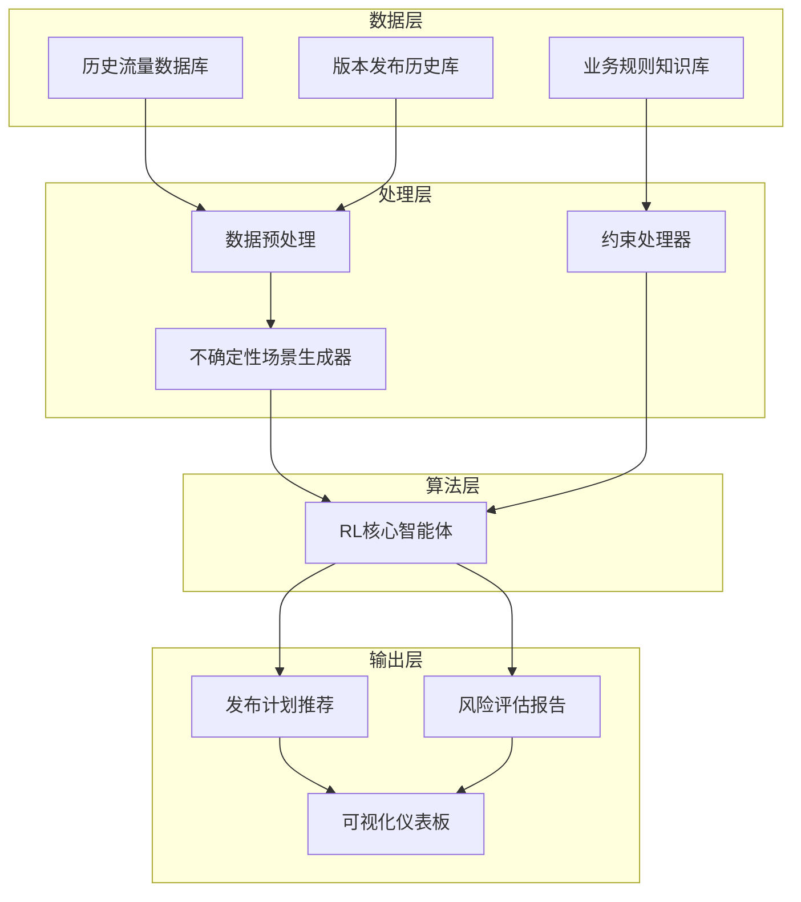

# 手机版本发布稳健优化系统设计文档（精简版）

## 1. 系统概述

### 1.1 项目背景

本系统旨在解决大规模手机软件版本发布过程中的流量调度优化问题，在缺乏精确预测能力的情况下，通过历史数据分析和稳健优化技术，实现自动化的发布计划编排。

### 1.2 设计目标

* 规避周末、节假日等非发布时段
* 确保首批用户比例不超过1%
* 维持批次数量在5-10个之间
* 实现流量平稳分布，避免峰值
* 提供风险评估与应对方案

### 1.3 系统特点

* **强化学习为核心**：统一决策引擎
* **辅助优化模块**：进化算法与鲁棒优化嵌入RL框架
* **业务规则内嵌**：所有约束条件通过约束处理器强制执行
* **稳健性优先**：在不确定性环境下优化

## 2. 系统架构

### 2.1 整体架构

```
数据层 → 处理层 → 算法层（RL核心 + 辅助优化模块） → 输出层
```

* **数据层**：历史流量数据库、版本发布历史库、业务规则知识库
* **处理层**：数据预处理、场景生成、约束处理
* **算法层**：RL核心智能体，内嵌进化算子与鲁棒优化机制
* **输出层**：发布计划推荐、风险评估、可视化

### 2.2 模块交互图



## 3. 核心模块设计

### 3.1 数据预处理模块

* 清洗和标准化历史数据，提取流量统计特征
* 标识节假日和非工作日
* 分析历史发布批次与比例分布

### 3.2 不确定性场景生成器

* 使用核密度估计建模流量分布
* 基于马尔可夫链生成转移模式
* 注入极端事件模拟异常情况
* 输出覆盖正常和极端情况的场景集

### 3.3 约束处理器

* **时间约束**：排除节假日、重复发布冲突
* **比例约束**：首批≤1%，总和100%
* **批次约束**：数量限制在5-10，控制间隔

## 4. 算法层设计（精简）

### 4.1 强化学习核心智能体

* **状态**：日期、剩余天数、历史流量特征、约束满足情况
* **动作**：发布/不发布、调整比例、调整批次数量
* **奖励**：流量平滑度提升、约束遵守、跨场景稳定性
* **学习机制**：策略网络在训练中引入进化算子（探索多解），鲁棒优化作为奖励修正（防止最坏情况）

### 4.2 内嵌优化机制

* **进化算子**：在RL探索阶段引入变异/交叉，增加解的多样性
* **鲁棒修正**：在奖励函数中注入最坏场景约束，确保方案稳健性

## 5. 输出层设计

* **发布计划推荐**：输出最优版本发布方案
* **风险评估报告**：包含均值、峰值、最坏情况指标
* **可视化仪表板**：直观展示流量曲线与风险指标

## 6. 工作流程

1. **数据准备** → 更新历史数据
2. **场景生成** → 构造多场景输入
3. **RL优化** → 智能体生成候选方案
4. **内嵌优化** → 进化与鲁棒机制增强稳健性
5. **约束校验** → 确保所有业务规则满足
6. **方案输出** → 推荐主方案与风险评估

## 7. 预期成果

* 自动化发布计划
* 平稳分布的流量调度
* 在多场景下具备稳健性
* 可解释的风险评估
* 持续自适应优化

该精简方案以强化学习为核心，将进化与鲁棒优化内嵌为辅助机制，简化架构层级的同时保留稳健性与多目标优化能力，减少系统复杂度并提升执行效率。
