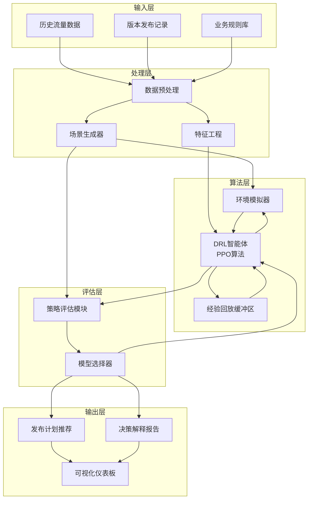

# 手机版本发布纯强化学习优化系统设计文档

## 1. 系统概述

### 1.1 设计理念
本方案采用纯强化学习架构，通过精心设计的状态空间、动作空间和奖励函数，将多目标优化、稳健性要求和业务约束全部融入端到端的强化学习框架中。

### 1.2 核心创新
- **统一框架**：所有决策逻辑统一在单一强化学习模型中
- **约束内化**：业务规则通过状态表征和奖励函数直接融入学习过程
- **自适应学习**：通过环境交互自主学习最优发布策略

## 2. 纯强化学习系统架构



## 3. 核心模块设计

### 3.1 环境模拟器设计

**状态空间设计**：
```python
class State:
    # 时间特征
    current_day: int  # 当前日期（0-30）
    day_of_week: int  # 星期几（0-6）
    is_holiday: bool  # 是否是节假日
    
    # 流量特征
    recent_traffic: List[float]  # 最近7天流量
    traffic_trend: float  # 流量趋势（斜率）
    traffic_variance: float  # 流量波动性
    
    # 版本特征
    pending_versions: List[VersionInfo]  # 待发布版本信息
    released_versions: List[ReleaseRecord]  # 已发布版本记录
    
    # 约束状态
    constraint_violations: Dict[str, int]  # 各约束违反次数
    batch_count: int  # 当前已安排批次数量
```

**状态更新机制**：
- 每日自动推进时间状态
- 基于历史模式生成模拟流量
- 跟踪版本发布状态和约束遵守情况

### 3.2 DRL智能体设计

**网络架构**：
```python
class ReleasePPOPolicy(nn.Module):
    def __init__(self, state_dim, action_dim):
        super().__init__()
        # 特征提取层
        self.feature_extractor = nn.Sequential(
            nn.Linear(state_dim, 256),
            nn.ReLU(),
            nn.Linear(256, 128),
            nn.ReLU()
        )
        
        # 策略头
        self.policy_head = nn.Sequential(
            nn.Linear(128, 64),
            nn.ReLU(),
            nn.Linear(64, action_dim)
        )
        
        # 价值头
        self.value_head = nn.Sequential(
            nn.Linear(128, 64),
            nn.ReLU(),
            nn.Linear(64, 1)
        )
```

**动作空间设计**：
- **离散动作**：{发布版本A, 发布版本B, ..., 暂不发布}
- **连续参数**：发布比例（0-1）、发布时间偏移（-3 to +3天）

### 3.3 奖励函数设计

**多目标奖励函数**：
```python
def calculate_reward(self, state, action, next_state):
    reward = 0
    
    # 基础流量奖励（负方差）
    traffic_variance = self.calculate_traffic_variance(next_state)
    reward -= traffic_variance * 0.1
    
    # 峰值惩罚
    peak_penalty = self.calculate_peak_penalty(next_state)
    reward -= peak_penalty * 0.2
    
    # 约束遵守奖励
    constraint_bonus = self.calculate_constraint_bonus(action, state)
    reward += constraint_bonus * 0.3
    
    # 进度奖励（鼓励按时完成发布）
    progress_bonus = self.calculate_progress_bonus(state, next_state)
    reward += progress_bonus * 0.1
    
    # 探索奖励（鼓励尝试新策略）
    exploration_bonus = self.calculate_exploration_bonus(action)
    reward += exploration_bonus * 0.01
    
    return reward
```

**约束奖励细节**：
```python
def calculate_constraint_bonus(self, action, state):
    bonus = 0
    
    # 时间约束
    if self.is_valid_release_day(action):
        bonus += 0.5
    else:
        bonus -= 2.0  # 严重惩罚违规
    
    # 比例约束
    if action.release_ratio <= 0.01:  # 首批比例≤1%
        bonus += 0.3
    else:
        bonus -= 1.0
    
    # 批次约束
    if 5 <= state.batch_count + 1 <= 10:  # 批次数量限制
        bonus += 0.2
    else:
        bonus -= 1.5
    
    return bonus
```

## 4. 训练策略设计

### 4.1 课程学习策略

**难度递增**：
1. **阶段一**：简单场景，少量版本，固定流量模式
2. **阶段二**：中等场景，增加版本数量，引入流量波动
3. **阶段三**：复杂场景，多版本并发，极端流量事件

**课程切换条件**：
- 当前策略在现有课程上达到性能阈值
- 策略在验证集上表现稳定
- 手动触发课程升级

### 4.2 探索策略

**自适应探索**：
```python
def adaptive_exploration(self, episode):
    # 随着训练进行逐渐减少探索率
    base_epsilon = 0.3
    min_epsilon = 0.01
    decay_rate = 0.995
    
    epsilon = max(min_epsilon, base_epsilon * (decay_rate ** episode))
    
    # 在性能平台期增加探索
    if self.performance_stagnant():
        epsilon = min(0.5, epsilon * 1.5)
    
    return epsilon
```

### 4.3 稳健性训练

**多环境训练**：
- 同时在不同流量模式的多个环境实例中训练
- 定期在所有环境上评估策略性能
- 选择在最坏环境下表现最好的策略

**对抗训练**：
-  intentionally 在训练中注入极端流量事件
- 训练策略应对异常情况的能力
- 提高策略的稳健性和泛化能力

## 5. 评估与选择机制

### 5.1 多场景评估

**评估流程**：
1. 在保留的测试场景集上评估当前策略
2. 计算多个性能指标：
   - 平均流量方差
   - 95%分位带宽值
   - 约束违反次数
   - 最坏情况性能
3. 生成综合性能评分

### 5.2 模型选择策略

**选择标准**：
```python
def select_best_model(self, model_candidates):
    best_score = -float('inf')
    best_model = None
    
    for model in model_candidates:
        # 计算综合评分
        score = 0
        score += model.avg_performance * 0.4
        score -= model.worst_case_performance * 0.3
        score -= model.constraint_violations * 0.3
        
        if score > best_score:
            best_score = score
            best_model = model
    
    return best_model
```

## 6. 实施细节

### 6.1 训练超参数

**PPO参数**：
```yaml
learning_rate: 0.0003
clip_range: 0.2
entropy_coef: 0.01
value_coef: 0.5
max_grad_norm: 0.5
batch_size: 64
n_steps: 2048
n_epochs: 10
```

**训练设置**：
```yaml
total_timesteps: 1000000
parallel_envs: 8
eval_frequency: 10000
checkpoint_frequency: 50000
```

### 6.2 模型保存与部署

**模型版本化**：
- 定期保存模型检查点
- 记录每个模型的性能指标和训练配置
- 使用模型注册表管理不同版本的策略

**部署策略**：
1. 在测试环境中验证新模型性能
2. 逐步灰度发布新策略
3. 监控线上性能并准备回滚机制

## 7. 优势与挑战

### 7.1 优势
- **简洁架构**：单一模型解决复杂决策问题
- **端到端优化**：直接优化最终业务目标
- **自适应能力**：能够适应环境变化和新模式
- **可扩展性**：易于添加新约束和目标

### 7.2 挑战与应对
- **训练稳定性**：使用PPO等稳定算法，精心设计奖励函数
- **探索效率**：实现课程学习和自适应探索策略
- **约束满足**：通过奖励设计和动作掩码确保约束遵守
- **评估可靠性**：建立全面的多场景评估体系

## 8. 实施路线图

### 阶段一：基础环境与智能体（2周）
- 实现环境模拟器
- 构建基础PPO智能体
- 设计基础奖励函数

### 阶段二：训练策略优化（3周）
- 实现课程学习框架
- 开发自适应探索策略
- 优化网络架构和超参数

### 阶段三：稳健性增强（2周）
- 实现多环境训练
- 添加对抗训练机制
- 建立模型评估体系

### 阶段四：部署与监控（2周）
- 实现模型部署管道
- 建立线上监控系统
- 开发决策解释功能

这个纯强化学习方案通过精心设计的环境、奖励函数和训练策略，能够在不依赖其他优化算法的情况下，自主学习满足所有业务约束的最优发布策略。方案保持了架构的简洁性，同时通过课程学习、多环境训练等技术确保了算法的稳健性和性能。