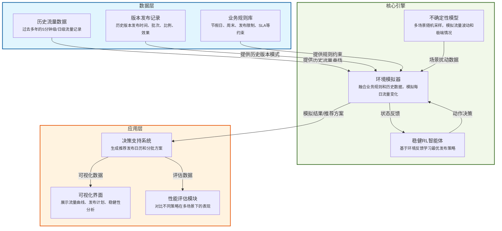

# 📦 手机发布版本编排强化学习系统  
**——稳健性优化与不确定性建模技术方案**

---

## 一、系统总体架构

---

## 二、核心设计理念
1. **只依赖可观测信息**  
   状态只基于当前和历史数据，不包含任何未来真实值。  
2. **不确定性建模**  
   在环境中引入多场景模拟与随机扰动，反映未来流量的波动性与不可预测性。  
3. **稳健性优化**  
   奖励函数同时考虑平均表现与最坏情况表现，确保策略在极端场景下仍表现良好。  
4. **业务规则内嵌**  
   发布日合法性检查（避开周末、节假日、重复发布），违规直接惩罚。  

---

## 三、系统模块说明

### 1. 数据层
- **历史流量数据**：过去多年5分钟/日级流量记录，作为模拟基线  
- **版本发布记录**：历史版本的发布时间、批次、比例、效果，用于学习版本影响模式  
- **业务规则库**：节假日、周末、SLA限制等业务约束条件  

### 2. 核心引擎
- **环境模拟器**：融合数据层信息，模拟每日流量变化，生成状态和奖励  
- **稳健RL智能体**：基于环境反馈学习最优策略，适应不同不确定性场景  
- **不确定性模型**：通过多场景随机采样，模拟流量波动和极端情况  

### 3. 应用层
- **决策支持系统**：生成推荐发布日历和分批方案  
- **可视化界面**：展示流量曲线、发布计划、稳健性指标  
- **性能评估模块**：对比不同策略（RL、GA、人工方案）在多场景下的表现  

---

## 四、环境设计

### 状态空间（State）
- 当前天数（0~30）
- 剩余天数（0~31）
- 发布日历（31位二进制数组）
- 版本信息（用户数、包大小、周期、试点比例、流量模式均值）
- 历史流量统计特征（均值、标准差、25分位、75分位）
- 流量趋势（最近7天均值与前7天均值变化率）

### 动作空间（Action）
- 0：不发布
- 1：发布当前待发布版本

### 规则校验
- 避开周末、节假日
- 避免同日重复发布
- 非法动作直接给予大负奖励

---

## 五、不确定性模拟
- **多场景生成**：每次发布动作生成K个可能的未来流量场景（默认100个）  
- **历史基线驱动**：基于历史同期数据采样未来每日流量基线  
- **版本影响模型**：
  - 基础影响 = 用户数 × 包大小 × 流量模式均值
  - 随机扰动因子（如正态分布 N(1.0, 0.3)）
  - 影响持续指定天数并按比例衰减

---

## 六、奖励函数（Reward）
奖励由三部分组成：
1. **平均方差惩罚**：  
   对K个场景计算整月流量的方差并取平均值，值越小越好
2. **最坏情况惩罚**：  
   找出方差最大的场景，乘以权重β进行惩罚
3. **规则违规惩罚**：  
   非法发布日直接扣除固定大额分数

公式：
$$
Reward = -\text{avg\_variance} - \beta \times \text{worst\_variance} - P_{illegal}
$$

---

## 七、训练与评估流程

### 训练流程
1. 初始化环境与智能体  
2. 每个训练回合：
   - 重置环境，随机化节假日、流量波动等参数（域随机化）
   - 智能体基于状态选择动作
   - 环境执行动作，返回新状态与奖励
   - 存储经验并持续到月末或版本发布完毕
3. 回合结束后更新策略  
4. 定期保存最佳模型

### 评估方法
- **多场景评估**：  
  在固定极端流量波动场景下测试策略，计算平均方差、最坏情况方差等稳健性指标  
- **对比基准**：  
  与遗传算法（GA）方案比较最坏场景表现  
- **可视化**：  
  绘制训练曲线与流量分布，生成发布日历CSV供业务分析  

---

## 八、实施步骤与时间规划

| 阶段 | 时间 | 工作内容 |
|------|------|----------|
| 阶段1 | 1-2周 | 数据准备与清洗，收集历史流量与版本信息 |
| 阶段2 | 2周 | 环境模拟器开发，复用GA的版本与流量计算逻辑 |
| 阶段3 | 2周 | 引入不确定性模拟与稳健性奖励 |
| 阶段4 | 2-4周 | 使用PPO训练智能体，调参优化（β、K、波动范围等） |
| 阶段5 | 1周 | 稳健性评估与与GA对比分析 |
| 阶段6 | 持续 | 部署上线，结合业务反馈迭代优化 |

---

## 九、预期效果
- **抗不确定性**：在流量预测不准确的情况下依然能生成稳定方案  
- **规则合规性**：自动避开节假日、周末和冲突日  
- **全月均衡**：减少峰值，降低带宽压力  
- **可解释性**：通过多场景分析理解策略决策依据  
- **可扩展性**：可根据业务变化调整奖励权重、动作空间等  

---

## 十、关键技术细节补充

### 10.1 状态设计优化
状态表示采用归一化处理，将所有特征缩放到相同尺度，提高学习效率。历史流量特征采用滑动窗口方式，动态反映最近流量模式变化。

### 10.2 动作空间扩展
考虑扩展动作空间，包括：
- 发布时机选择（立即发布、延迟发布）
- 发布比例调整（小范围调整发布用户比例）
- 批次拆分策略（将大版本拆分为多个小批次）

### 10.3 奖励函数精细化设计
奖励函数进一步细化：
- 引入流量平滑度奖励，鼓励相邻日期间流量平稳过渡
- 添加资源利用率奖励，鼓励合理利用带宽资源
- 考虑业务优先级权重，重要版本给予更高奖励

### 10.4 不确定性模型增强
不确定性模型采用分层设计：
- 第一层：基础流量波动，基于历史同期数据分布
- 第二层：特殊事件影响，模拟突发流量变化
- 第三层：版本发布效应，考虑版本间相互影响

### 10.5 训练策略优化
采用课程学习策略，从简单场景开始训练，逐步增加环境复杂性：
1. 初期：固定流量模式，低不确定性
2. 中期：引入中等程度波动和不确定性
3. 后期：全随机环境，高不确定性训练

### 10.6 实时决策支持
系统支持实时决策模式：
- 输入当前状态和待发布版本信息
- 输出立即决策建议和长期规划展望
- 提供决策置信度和风险评估

### 10.7 模型解释性增强
集成SHAP等可解释AI技术：
- 可视化各特征对决策的影响程度
- 提供决策依据和关键因素分析
- 生成易于理解的决策报告

### 10.8 在线学习机制
设计在线学习框架：
- 持续收集实际发布效果数据
- 定期更新模型适应新模式
- 支持人工反馈介入学习过程

---

## 十一、风险与应对措施

### 11.1 技术风险
- **训练不稳定**：采用PPO-Clip等稳定算法，设置梯度裁剪
- **过拟合**：使用早停策略，正则化技术，交叉验证
- **探索不足**：设计基于不确定性的探索奖励，鼓励尝试新策略

### 11.2 业务风险
- **规则变化**：设计可配置规则引擎，支持动态调整
- **流量模式突变**：建立异常检测机制，触发模型重新训练
- **版本特性变化**：设计版本特征编码，适应新型版本发布

### 11.3 实施风险
- **数据质量**：建立数据质量监控和清洗流程
- **系统集成**：提供标准化API接口，降低集成复杂度
- **性能要求**：优化推理速度，满足实时决策需求

---

## 十二、团队协作与交付物

### 12.1 团队角色分工
- **数据工程师**：负责数据收集、清洗和预处理
- **算法工程师**：负责环境模拟器和RL算法实现
- **后端工程师**：负责系统集成和API开发
- **前端工程师**：负责可视化界面开发
- **产品经理**：负责需求管理和业务对接

### 12.2 阶段性交付物
- **阶段1**：数据字典和样本数据集
- **阶段2**：环境模拟器核心框架
- **阶段3**：不确定性模拟模块
- **阶段4**：训练完成的基准模型
- **阶段5**：完整评估报告和对比分析
- **阶段6**：可部署的系统原型

### 12.3 质量保障措施
- 代码审查和单元测试覆盖
- 模型性能基准测试
- 端到端集成测试
- 用户验收测试流程

---

## 十三、总结与展望

本方案通过将稳健强化学习与不确定性建模相结合，为手机版本发布编排问题提供了一个全面而实用的解决方案。系统不仅能够在不确定性环境下做出优质决策，还具备良好的可解释性和扩展性。

未来可进一步探索的方向包括：
- 多智能体协作框架，处理多版本并发发布
- 元学习能力，快速适应新的流量模式
- 联邦学习应用，在保护隐私的前提下利用多方数据
- 与深度学习结合，从原始流量数据中自动学习特征表示

通过本方案的实施，将显著提升版本发布管理的智能化水平，为业务带来实际价值。

请基于上述方案和前述规则，重新设计新的方案