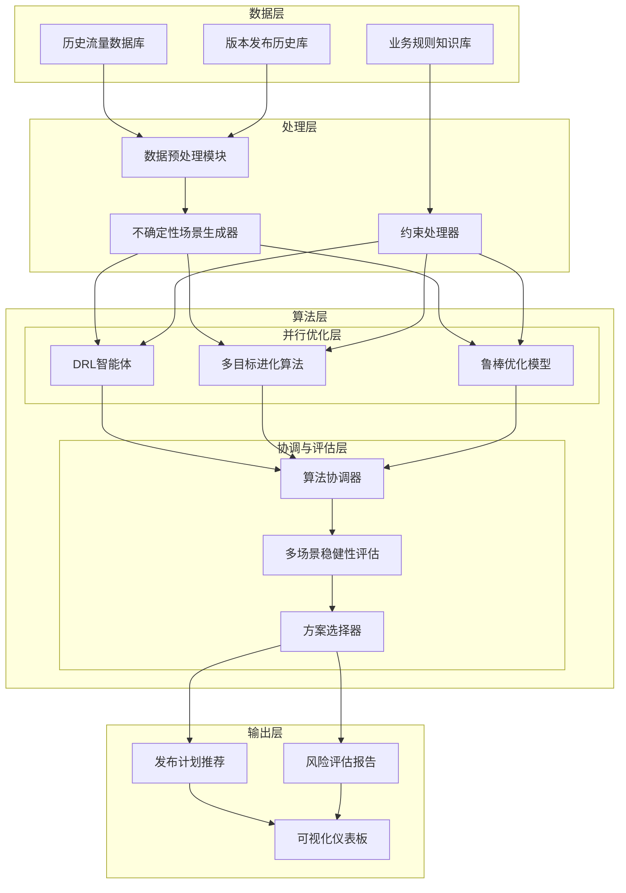

# 手机版本发布稳健优化系统设计文档

## 1. 系统概述

### 1.1 项目背景
本系统旨在解决大规模手机软件版本发布过程中的流量调度优化问题，在缺乏精确5分钟粒度预测能力的情况下，通过历史数据分析和稳健优化技术，实现发布计划的自动化编排。

### 1.2 设计目标
- 规避周末、节假日等非发布时段
- 确保首批用户比例不超过1%
- 维持批次数量在5-10个之间
- 实现流量平稳分布，避免峰值
- 提供多种风险评估和应对方案

### 1.3 系统特点
- **稳健性优先**：专为处理不确定性设计
- **多算法融合**：结合强化学习、进化算法和鲁棒优化
- **业务规则内嵌**：所有约束条件在核心模块中实现
- **可视化支持**：提供直观的决策支持界面

## 2. 系统架构

### 2.1 整体架构
系统采用分层架构设计，分为数据层、处理层、算法层和输出层四个主要部分：

```
数据层 → 处理层 → 算法层 → 输出层
```

- **数据层**：历史流量数据库、版本发布历史库、业务规则知识库
- **处理层**：数据预处理、场景生成、约束处理
- **算法层**：多算法优化引擎（并行优化层 + 协调与评估层）
- **输出层**：方案推荐、风险评估、可视化

### 2.2 模块交互图



## 3. 核心模块设计

### 3.1 数据预处理模块
**功能**：清洗和标准化历史数据，提取特征供后续使用

**业务规则实现**：
- 标识并标记历史数据中的周末和节假日
- 提取历史发布批次的数量和比例分布
- 计算历史流量的统计特征（均值、方差、峰值等）

### 3.2 不确定性场景生成器
**功能**：基于历史数据生成多种可能的未来流量场景

**实现机制**：
- 使用核密度估计建模历史流量分布
- 基于马尔可夫链生成流量转移模式
- 注入历史极端事件模拟异常情况
- 生成数百个可能未来场景，覆盖正常和极端情况

### 3.3 约束处理器
**功能**：集中管理和执行所有业务规则约束

**业务规则实现**：
1. **时间约束**：
   - 维护节假日日历库，自动排除非工作日
   - 检查发布时间是否在版本允许的时间范围内
   - 防止同日重复发布

2. **比例约束**：
   - 确保首批比例≤1%
   - 控制各批次比例在合理范围内
   - 保证总比例和为100%

3. **批次约束**：
   - 限制批次数量在5-10个之间
   - 控制批次间的最小时间间隔

## 4. 并行优化层设计

并行优化层包含三个相对独立又相互补充的优化模块，每个模块都有其独特的职责和优势。

### 4.1 深度强化学习智能体 (DRL Agent)

**核心职责**：序列决策优化
- **状态感知与表征**：
  - 实时解析当前系统状态（时间、已发布版本、流量情况）
  - 将状态编码为适合神经网络处理的表征

- **动作选择与执行**：
  - 在每个决策点选择最优动作（发布/等待、调整比例）
  - 平衡探索（尝试新策略）与利用（使用已知好策略）

- **长期回报优化**：
  - 评估当前决策对长期目标（月度流量平滑度）的影响
  - 通过价值函数学习不同状态的长期价值

- **策略持续改进**：
  - 根据环境反馈更新策略网络参数
  - 适应流量模式的变化和业务规则的调整

**优势特点**：适合处理序列决策问题，能够学习复杂的环境动态，具备在线学习能力

### 4.2 多目标进化算法 (Multi-Objective EA)

**核心职责**：全局帕累托前沿搜索
- **种群管理与进化**：
  - 维护一个多样化的解决方案种群
  - 通过选择、交叉、变异操作进化种群

- **多目标优化**：
  - 同时最小化流量方差、峰值高度和约束违反程度
  - 探索不同目标之间的权衡关系

- **约束处理**：
  - 确保解决方案满足所有业务规则约束
  - 使用罚函数或可行解优先策略处理约束

- **多样性保持**：
  - 防止算法过早收敛到局部最优
  - 确保帕累托前沿的覆盖范围和多样性

**优势特点**：能够找到多个可选方案，适合处理复杂约束问题，对问题结构假设较少

### 4.3 鲁棒优化模型 (Robust Optimization Model)

**核心职责**：最坏情况性能保障
- **不确定集建模**：
  - 基于历史数据构建合理的不确定集
  - 平衡稳健性和解决方案的保守程度

- **稳健 counterpart formulation**：
  - 将原始不确定问题转化为确定性的稳健优化问题
  - 确保解决方案在所有可能场景下都可行

- **保守性控制**：
  - 通过调整不确定集大小控制解决方案的保守程度
  - 在性能和稳健性之间找到合适平衡

- **极端场景防护**：
  - 特别关注极端但可能发生的场景
  - 防止在最坏情况下出现灾难性后果

**优势特点**：提供最坏情况性能保证，数学基础严密，适合风险厌恶的决策环境

## 5. 协调与评估层设计

协调与评估层是系统的"大脑"和"决策中心"，负责处理并行优化层产生的多个解决方案，并最终选出最佳发布计划。

### 5.1 算法协调器 (Algorithm Coordinator)

**作用**：交通指挥官，协调层的核心枢纽

**功能详述**：
1. **任务分发与调度**：
   - 接收从"场景生成器"生成的大量未来流量场景
   - 将这些场景同时分发给三个优化算法，触发并行计算

2. **算法管理与监控**：
   - 监控各个算法的运行状态和进度
   - 为每个算法设置计算超时时间，确保系统及时响应

3. **结果收集与标准化**：
   - 接收来自不同算法的、格式各异的解决方案
   - 将这些解决方案标准化为统一的内部数据结构

4. **资源协调**：
   - 在计算资源有限的情况下，智能地分配资源给不同的算法
   - 优先分配给在历史评估中表现更好的算法

### 5.2 多场景稳健性评估 (Multi-Scenario Robustness Evaluation)

**作用**：压力测试中心，全面评估解决方案的稳健性

**功能详述**：
1. **场景模拟**：
   - 为每一个待评估的解决方案，运行所有未来流量场景
   - 模拟在每个场景下，执行该发布计划后的每日带宽流量曲线

2. **性能指标计算**：
   - 对于每条模拟出的流量曲线，计算关键绩效指标：
     - 月流量方差：衡量整体波动性
     - 95分位带宽值：直接对应成本的核心指标
     - 最大峰值：衡量单点最高负载
     - 超过阈值的天数/次数：衡量风险频率

3. **稳健性指标聚合**：
   - 将一个方案在所有场景下的性能指标进行聚合：
     - 平均表现：在所有场景下的平均成本
     - 最坏表现：在所有场景中最高的成本
     - 表现标准差：方案表现的波动性

### 5.3 方案选择器 (Solution Selector)

**作用**：首席决策官，基于全面数据选择最佳发布计划

**功能详述**：
1. **应用决策规则**：
   - 根据公司的风险偏好，应用不同的决策规则：
     - 最小化最坏情况：选择最坏情况下表现最好的方案
     - 最佳期望值：选择平均表现最好的方案
     - 多标准决策：在多个维度上加权评分，选择综合分最高的方案

2. **生成推荐与备选**：
   - 输出最终推荐方案作为主计划
   - 提供1-2个备选方案供决策者参考

3. **生成洞察与报告**：
   - 自动生成风险评估报告，说明推荐方案的理由
   - 可视化不同方案在不同场景下的表现分布

## 6. 业务规则实现细节

### 6.1 时间约束实现
在约束处理器中维护一个全局日历服务，提供以下功能：
```plaintext
1. 日期合法性检查：接收日期输入，返回是否允许发布
2. 时间窗口验证：检查发布时间是否在版本允许的时间范围内
3. 冲突检测：防止多个版本在同一时间发布
```

### 6.2 比例约束实现
在解决方案生成和评估过程中嵌入比例检查：
```plaintext
1. 初始方案生成时，首批比例强制≤1%
2. 进化算法变异时，比例调整在约束范围内进行
3. 解决方案评估时，比例约束违反会施加严重惩罚
```

### 6.3 批次约束实现
通过以下方式确保批次数量合规：
```plaintext
1. 染色体编码中直接限制批次数量基因的取值范围
2. 强化学习动作空间中包含批次数量调整动作
3. 解决方案评估时检查批次数量是否在5-10之间
```

## 7. 工作流程

### 7.1 日常运行流程
1. **数据准备**：收集最新历史数据，更新场景生成器
2. **场景生成**：基于当前状态生成多个未来流量场景
3. **优化求解**：并行运行多种优化算法
4. **方案评估**：在所有场景下评估各方案的稳健性
5. **结果选择**：选择最稳健的解决方案
6. **输出展示**：生成发布计划和风险评估报告

### 7.2 异常处理流程
1. **约束违反检测**：实时监控解决方案的合规性
2. **自适应调整**：对违反约束的解决方案进行修复
3. **备选方案激活**：当主方案不可行时启用备用方案
4. **人工干预接口**：提供人工覆盖和调整能力

## 8. 评估与监控

### 8.1 性能评估指标
1. **业务指标**：
   - 约束违反次数和严重程度
   - 流量平滑度改进程度
   - 峰值削减效果

2. **算法指标**：
   - 求解时间和计算资源消耗
   - 解决方案的稳健性指标
   - 算法收敛性能

### 8.2 监控体系
1. **实时监控**：跟踪系统运行状态和性能指标
2. **异常警报**：发现异常情况时及时告警
3. **日志记录**：详细记录决策过程和结果
4. **定期评估**：周期性评估系统性能和改进需求

## 9. 实施路线图

### 阶段一：基础框架搭建（2-3周）
- 数据管道建设和预处理模块开发
- 基础约束处理器实现
- 简单优化算法原型开发

### 阶段二：核心算法开发（4-5周）
- 不确定性场景生成器实现
- 多算法优化引擎开发
- 初步集成测试

### 阶段三：系统优化与测试（3-4周）
- 算法调优和性能优化
- 大规模测试和验证
- 用户界面开发

### 阶段四：部署与运维（2周）
- 生产环境部署
- 监控体系建立
- 用户培训和支持

## 10. 预期成果

1. **自动化发布计划**：生成符合所有业务规则的发布计划
2. **流量平稳分布**：显著降低流量峰值和波动
3. **稳健决策支持**：提供多种场景下的风险评估
4. **可视化监控**：直观展示优化结果和系统状态
5. **持续改进机制**：基于反馈不断优化系统性能

本设计通过系统化的模块设计和清晰的业务规则实现位置安排，确保了系统既能满足所有业务约束，又能在不确定性环境下实现稳健优化。多算法融合架构保证了系统的可靠性和适应性，为手机版本发布提供了全面的决策支持。